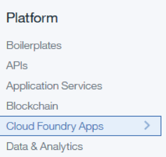
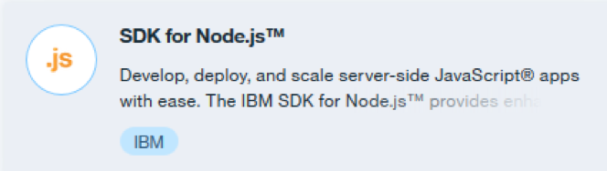

# Walking on a Cloud

This workshop is intended to provide an introduction to cloud-based programming with IBM Cloud. It provides step-by-step instructions for setting up an IBM Cloud account with a simple Cloudant® database, creating a basic web app in JavaScript, and utilizing Watson™ APIs.

## Web App Activity List

This repository consists of lab exercises that will show you how to create a web application that runs on an IBM Cloud server. The application consists of a node.js server that accesses a Cloudant® database and uses the IBM Watson™ Language Translator service. Each lab exercise will introduce new concepts that will progressively build up to a fully functional web application. These are some of the techniques we used to build our app: [thinkinfinity.mybluemix.net/](thinkinfinity.mybluemix.net/). The source code for the web application can be found at: [github.com/danacv2/ThinkInfinity](github.com/danacv2/ThinkInfinity).

1.	Hello World – This exercise will start off with setting up IBM Cloud to run your application. The application will be a simple web page that contains the text Hello World.
2.	Cloudant Introduction – This exercise adds a Cloudant database to your application and explains how to setup and retrieve information from it.
3.	Create Database Entries – This exercise will expand what was discussed in the previous section and go into more details of how to input data into your database.
4.	GUI Introduction – This exercise discusses how to add graphical elements to your web application.
5.	Watson Language Translator Introduction – This exercise adds a Watson Language Translator to your application and explains how to use the service to translate text.

## Hello World

In this section we will go over creating a node.js project in IBM Cloud and the basic setup. We will create a simple hello world application that will run on a node.js server with a simple webpage.

1.	Login to IBM Cloud or create an account.
2.	From the main page click on Catalog in the upper right hand side.

3.	Click on Cloud Foundry Apps under Platform.

4.	Choose SDK for Node.js.

(Content Under Development)