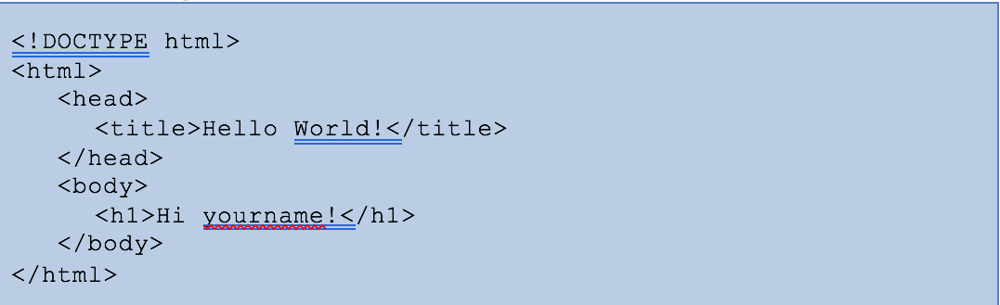

# Walking on a Cloud

This workshop is intended to provide an introduction to cloud-based programming with IBM Cloud. It provides step-by-step instructions for setting up an IBM Cloud account with a simple Cloudant® database, creating a basic web app in JavaScript, and utilizing Watson™ APIs.

## Web App Activity List

This repository consists of lab exercises that will show you how to create a web application that runs on an IBM Cloud server. The application consists of a node.js server that accesses a Cloudant® database and uses the IBM Watson™ Language Translator service. Each lab exercise will introduce new concepts that will progressively build up to a fully functional web application. These are some of the techniques we used to build our app: [thinkinfinity.mybluemix.net/](thinkinfinity.mybluemix.net/). The source code for the web application can be found at: [github.com/danacv2/ThinkInfinity](github.com/danacv2/ThinkInfinity).

1.	Hello World – This exercise will start off with setting up IBM Cloud to run your application. The application will be a simple web page that contains the text Hello World.
2.	Cloudant Introduction – This exercise adds a Cloudant database to your application and explains how to setup and retrieve information from it.
3.	Create Database Entries – This exercise will expand what was discussed in the previous section and go into more details of how to input data into your database.
4.	GUI Introduction – This exercise discusses how to add graphical elements to your web application.
5.	Watson Language Translator Introduction – This exercise adds a Watson Language Translator to your application and explains how to use the service to translate text.

## Hello World

In this section we will go over creating a node.js project in IBM Cloud and the basic setup. We will create a simple hello world application that will run on a node.js server with a simple webpage.

1.	Login to IBM Cloud or create an account.
2.	From the main page click on Catalog in the upper right hand side.


3.	Click on Compute under All Categories.


4.	Scroll down until you find SDK for Node.js.


5.	Enter a unique name for the app. If the name is not unique, you will get an error. As an example, you can put your user name in front of the app name. Leave the rest with the default values and click Create at the bottom of the page.


6.	Your app is being deployed and may take a few minutes to start. View the status near the top of the page and verify that your app is eventually running. Don't be alarmed if the status says the app is not running. Click on Overview to manage your new app.


7.	Scroll to the bottom and look for the box that says Continuous Delivery. Click Enable


8.	A new page will open for Continuous Delivery Toolchain. 

9.	Under Tool Integrations, select Git Repos and Issue Tracking. Create a Git Repository by cloning from the nodejs HelloWorld starter code (automatically filled in for you). Enter a Repository Name. You can uncheck Make this repository private if you want to be able to share your code. Click Create.


10.	This will create a toolchain for your app. Now lets click on Eclipse Orion Web IDE to edit your code.


11.	You may need to create a new launch configuration. Click the dropdown next to Create a new launch configuration, then click the plus sign.


12.	Take the default values in the popup that opens and click Save.

13.	Click on Live Edit near the top center. This allows you to see changes reflected on your page as you make them. When asked to redeploy your app to enable live editing, click on OK. Wait until the app is running before continuing.


14.	Click on the box with an arrow pointing to the upper right (open the deployed app) and see the basic webpage that it gives you. If your app is not yet running, you will get an error and the page will not load.


This is a real web page accessible from any device. You can type the URL into your mobile phone to view it.

We want our website to have our own things so let's customize it. Return to the previous tab with the DevOps code.

16. From the file list on the left, click on public then index.html


17. The code should appear in the pane on the right. Select all the code and delete it (press Ctrl+A, then Delete)

18. In this repository, go to snippets/index.html and add the code found in the document (substituting yourname for your actual name).



19. Save your changes.


20. HTML is what your browser uses to generate a web page. For more info on HTML, you can search the internet for tutorials.


Our initial page will simply have a head tag which puts text at the top of the browser window and a body tag which contains the text to be displayed on the web page.

21. Go back to the browser page with your app and refresh to see the changes. (there might be a delay in how fast you can refresh).

### Bonus: How the Server Works

Now that our Hello World app is complete, let’s go over some of the details of how the server code works. Choose file app.js to see the server code. This is the node.js portion of your application, which runs on the server.


* *Line 9*: `var express = require('express');` Require is used to import required modules (in this case express). Basically, this tells the compiler that you are going to be using it. Express is a library that makes it easier to setup the server.

* *Line 16*: `var app = express();` This will create the server.

* *Line 19*: `app.use(express.static(__dirname + '/public'))` This tells the server that you will be using the "public" directory as your default directory. If you look at the files on the left-hand side, you'll notice that the index.html file resides in this directory. This is how the server knows where to get that file.

* *Lines 25-28:* 


This tells the server to listen for connection requests. A connection will happen when you tell your browser to visit that page.

## Connecting to a Database

### Cloudant Introduction

In this tutorial, you'll learn how to setup and use a database for your app. A database allows you to store information and retrieve it later. A website like Facebook will use a database to store your pictures, posts, profile information etc. This tutorial assumes that you have completed the Hello World tutorial.

You can think of a Cloudant database as a box that holds a collection of similar objects called documents. Each document will have a list of properties with their respective values as name-value pairs in a format called JSON. For instance, the properties could be the name, color, type etc.

As an example, imagine a box full of toys. You can use a database to represent the box. Each toy will have a corresponding document and each document will describe each toy with name value pairs such as type:ball, color:red, size:big etc.

1. Login to IBM Cloud.

2. From the main page, click on Catalog in the upper right-hand side.

3. We are going to add a database service to our app. Under Databases click on Cloudant.


4. You can take the default values and just click Create at the bottom of the screen.

5. Go back to the Dashboard (you can get there by clicking IBM Cloud in the upper left). There, you’ll see any applications that you have created. You should have at least 1 item from the previous tutorial. Click on the name of the app you created in the Hello World tutorial. Be careful not to click on the link as that will open your app. We want to make some changes first.


6. On the left-hand side, click on Connections.


7. We are going to connect the database service we just created to our app. Click Create Connection on the upper right side. This will generate a list of your existing services you can connect to your app. You should see the database you just created in the list.


8. Click the Connect button on the right to connect your database to your app. Click Restage to restart your app so that it can now use the database.


9. Once your app is running, click on Overview on the left-hand side.


10.	We need to setup the database. Click on Cloudant NoSQL near the bottom left of the screen.


11.	Click the Launch button near the top right to enter the database setup screen.


12.	Click on Databases on the left-hand side.


13.	At this point we haven't created any databases so we'll need to create one by clicking on Create Database at the top right and entering a name for your new database. Note: the database name cannot contain capital letters. Once you have typed in the name, you can click Create.


14.	Now that we have created the database, we need to create a document. Click on the + sign next to All Documents and choose New Doc from the pull-down menu.


15.	Next to _id you'll find a long value. This is an automatic name given to the document. You'll want to change this to something easier to remember so that we can retrieve this document from our app. The id and document name are the first name-value pair and must be separated by a : with each name or value in quotes. The list of the name-value pairs must be surrounded by curly braces { }. Now add another name-value pair for a number. The new name-value pair must be separated from the first with a comma (,). Click Create Document to create it.


16.	Now that you have your database and document created, you can close this window (database setup) and go back to the previous window which you used to launch the database setup window. From this window hit your browser's back button to go back to the app's overview page. Let's now go and edit our code as we did in the previous tutorial. Click View Toolchain at the bottom of your screen. 


17.	Click on Eclipse Orion Web IDE to edit your code


18.	Click package.json to edit it. At the end of line 10, add a comma, then enter lines 11 and 12 shown below. This file is used to tell the server what dependencies our app will need. In this case, we will be using the nano and ejs libraries. Nano is what we will be using to access the database. Ejs will allow us to create an HTML template for the web page and embed JavaScript into the HTML. It also allows us to send variables from app.js to the HTML.


19. Copy the following to the dependencies.

```
"ejs": "*",
"nano": "*"
```

20. Rename index.html (in the public folder) to index.ejs. This changes our original HTML file into an ejs file. You can do this by right-clicking on index.html and choosing Rename.


21.	Express (see tutorial 1) needs template files to reside in the views directory. To create the views directory, right-click on your top level directory (your app's name) and choose New then Folder. Name your new folder: views.


22.	Open the public folder and move (drag and drop) index.ejs to the newly created views folder.


23.	Now we need to tell express that we want to use ejs as our template. Add line 17 to app.js.

``` app.set('view engine', 'ejs'); ```


24.	Next we will put in code in to retrieve the number we put in the database and render the webpage to display it. Add lines 22-46. Replace mydatabase with the name used when creating the database in step 12. Replace mydocument with the name used when creating the document in step 14. Replace number with the name used when inside the document created in step 14. (code found at snippets/database.js).


25.	Lastly, we will receive the number obtained from the database that was passed by app.js. Edit index.ejs and add lines 8 & 9 below. <%= number %> is the embedded JavaScript that indicates you want to receive the variable “number”. Remember to use the name that you specified in the document.


26.	Since we made changes on the server (app.js), we need to redeploy the app. Click on the arrow pointing right that appears next to the app status area. If you get a prompt to redeploy, click OK. Note: it may take several minutes for the app to redeploy.


27.	Once the status is back to running, you can open the app by clicking on the square with the arrow pointing up and to the right.


28.	You should see something like the following:


## Creating and Accessing a Cloudant® Document — An Introduction to Database Entries using JSON

After you’ve begun your IBM Cloud account and set up your own Cloudant database, you’ll want to populate that database. Each Cloudant database entry is called a “document” and each document is written in JSON. This can be done programmatically or manually. For simplicity this activity covers the manual case. JSON is derived from JavaScript, but can be used by other programming languages in its language-independent description of data. The full syntax diagram can be found at www.json.org and the Cloudant Dashboard will help you ensure that each entry is syntactically correct.

View the web app page at  This page is constructed based on a single entry in a simple Cloudant database. Snippets of that Cloudant document are provided below with an explanation of how they are interpreted:


(Content Under Development)