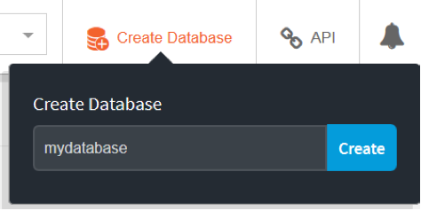
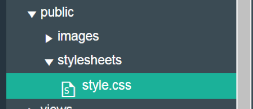
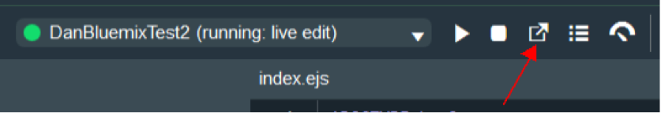

# Walking on a Cloud

This workshop is intended to provide an introduction to cloud-based programming with IBM Cloud. It provides step-by-step instructions for setting up an IBM Cloud account with a simple Cloudant® database, creating a basic web app in JavaScript, and utilizing Watson™ APIs.

## Web App Activity List

This repository consists of lab exercises that will show you how to create a web application that runs on an IBM Cloud server. The application consists of a node.js server that accesses a Cloudant® database and uses the IBM Watson™ Language Translator service. Each lab exercise will introduce new concepts that will progressively build up to a fully functional web application. These are some of the techniques we used to build our app: [thinkinfinity.mybluemix.net/](thinkinfinity.mybluemix.net/). The source code for the web application can be found at: [github.com/danacv2/ThinkInfinity](github.com/danacv2/ThinkInfinity).

1.	Hello World – This exercise will start off with setting up IBM Cloud to run your application. The application will be a simple web page that contains the text Hello World.
2.	Cloudant Introduction – This exercise adds a Cloudant database to your application and explains how to setup and retrieve information from it.
3.	Create Database Entries – This exercise will expand what was discussed in the previous section and go into more details of how to input data into your database.
4.	GUI Introduction – This exercise discusses how to add graphical elements to your web application.
5.	Watson Language Translator Introduction – This exercise adds a Watson Language Translator to your application and explains how to use the service to translate text.

## Hello World

In this section we will go over creating a node.js project in IBM Cloud and the basic setup. We will create a simple hello world application that will run on a node.js server with a simple webpage.

1.	Login to IBM Cloud or create an account.
2.	From the main page click on Catalog in the upper right hand side.


3.	Click on Compute under All Categories.


4.	Scroll down until you find SDK for Node.js.


5.	Enter a unique name for the app. If the name is not unique, you will get an error. As an example, you can put your user name in front of the app name. Leave the rest with the default values and click Create at the bottom of the page.


6.	Your app is being deployed and may take a few minutes to start. View the status near the top of the page and verify that your app is eventually running. Don't be alarmed if the status says the app is not running. Click on Overview to manage your new app.


7.	Scroll to the bottom and look for the box that says Continuous Delivery. Click Enable


8.	A new page will open for Continuous Delivery Toolchain. 

9.	Under Tool Integrations, select Git Repos and Issue Tracking. Create a Git Repository by cloning from the nodejs HelloWorld starter code (automatically filled in for you). Enter a Repository Name. You can uncheck Make this repository private if you want to be able to share your code. Click Create.


10.	This will create a toolchain for your app. Now lets click on Eclipse Orion Web IDE to edit your code.


11.	You may need to create a new launch configuration. Click the dropdown next to Create a new launch configuration, then click the plus sign.


12.	Take the default values in the popup that opens and click Save.

13.	Click on Live Edit near the top center. This allows you to see changes reflected on your page as you make them. When asked to redeploy your app to enable live editing, click on OK. Wait until the app is running before continuing.


14.	Click on the box with an arrow pointing to the upper right (open the deployed app) and see the basic webpage that it gives you. If your app is not yet running, you will get an error and the page will not load.


This is a real web page accessible from any device. You can type the URL into your mobile phone to view it.

We want our website to have our own things so let's customize it. Return to the previous tab with the DevOps code.

16. From the file list on the left, click on public then index.html


17. The code should appear in the pane on the right. Select all the code and delete it (press Ctrl+A, then Delete)

18. In this repository, go to snippets/index.html and add the code found in the document (substituting yourname for your actual name).

```
<!DOCTYPE html>
<html>
   <head>
<title>Hello World!</title>
   </head>
   <body>
<h1>Hi yourname!</h1>
   </body>
</html>

```

19. Save your changes.


20. HTML is what your browser uses to generate a web page. For more info on HTML, you can search the internet for tutorials.


Our initial page will simply have a head tag which puts text at the top of the browser window and a body tag which contains the text to be displayed on the web page.

21. Go back to the browser page with your app and refresh to see the changes. (there might be a delay in how fast you can refresh).

### Bonus: How the Server Works

Now that our Hello World app is complete, let’s go over some of the details of how the server code works. Choose file app.js to see the server code. This is the node.js portion of your application, which runs on the server.


* *Line 9*: `var express = require('express');` Require is used to import required modules (in this case express). Basically, this tells the compiler that you are going to be using it. Express is a library that makes it easier to setup the server.

* *Line 16*: `var app = express();` This will create the server.

* *Line 19*: `app.use(express.static(__dirname + '/public'))` This tells the server that you will be using the "public" directory as your default directory. If you look at the files on the left-hand side, you'll notice that the index.html file resides in this directory. This is how the server knows where to get that file.

* *Lines 25-28:* 

```
app.listen(appEnv.port, '0.0.0.0', function() {
// print a message when the server starts listening
console.log("server starting on " + appEnv.url);
});
```

This tells the server to listen for connection requests. A connection will happen when you tell your browser to visit that page.

## Connecting to a Database

### Cloudant Introduction

In this tutorial, you'll learn how to setup and use a database for your app. A database allows you to store information and retrieve it later. A website like Facebook will use a database to store your pictures, posts, profile information etc. This tutorial assumes that you have completed the Hello World tutorial.

You can think of a Cloudant database as a box that holds a collection of similar objects called documents. Each document will have a list of properties with their respective values as name-value pairs in a format called JSON. For instance, the properties could be the name, color, type etc.

As an example, imagine a box full of toys. You can use a database to represent the box. Each toy will have a corresponding document and each document will describe each toy with name value pairs such as type:ball, color:red, size:big etc.

1. Login to IBM Cloud.

2. From the main page, click on Catalog in the upper right-hand side.

3. We are going to add a database service to our app. Under Databases click on Cloudant.


4. You can take the default values and just click Create at the bottom of the screen.

5. Go back to the Dashboard (you can get there by clicking IBM Cloud in the upper left). There, you’ll see any applications that you have created. You should have at least 1 item from the previous tutorial. Click on the name of the app you created in the Hello World tutorial. Be careful not to click on the link as that will open your app. We want to make some changes first.


6. On the left-hand side, click on Connections.


7. We are going to connect the database service we just created to our app. Click Create Connection on the upper right side. This will generate a list of your existing services you can connect to your app. You should see the database you just created in the list.


8. Click the Connect button on the right to connect your database to your app. Click Restage to restart your app so that it can now use the database.


9. Once your app is running, click on Overview on the left-hand side.


10.	We need to setup the database. Click on Cloudant NoSQL near the bottom left of the screen.


11.	Click the Launch button near the top right to enter the database setup screen.


12.	Click on Databases on the left-hand side.


13.	At this point we haven't created any databases so we'll need to create one by clicking on Create Database at the top right and entering a name for your new database. Note: the database name cannot contain capital letters. Once you have typed in the name, you can click Create.



14.	Now that we have created the database, we need to create a document. Click on the + sign next to All Documents and choose New Doc from the pull-down menu.


15.	Next to _id you'll find a long value. This is an automatic name given to the document. You'll want to change this to something easier to remember so that we can retrieve this document from our app. The id and document name are the first name-value pair and must be separated by a : with each name or value in quotes. The list of the name-value pairs must be surrounded by curly braces { }. Now add another name-value pair for a number. The new name-value pair must be separated from the first with a comma (,). Click Create Document to create it.


16.	Now that you have your database and document created, you can close this window (database setup) and go back to the previous window which you used to launch the database setup window. From this window hit your browser's back button to go back to the app's overview page. Let's now go and edit our code as we did in the previous tutorial. Click View Toolchain at the bottom of your screen. 


17.	Click on Eclipse Orion Web IDE to edit your code


18.	Click package.json to edit it. At the end of line 10, add a comma, then enter lines 11 and 12 shown below. This file is used to tell the server what dependencies our app will need. In this case, we will be using the nano and ejs libraries. Nano is what we will be using to access the database. Ejs will allow us to create an HTML template for the web page and embed JavaScript into the HTML. It also allows us to send variables from app.js to the HTML.


19. Copy the following to the dependencies.

```
"ejs": "*",
"nano": "*"
```

20. Rename index.html (in the public folder) to index.ejs. This changes our original HTML file into an ejs file. You can do this by right-clicking on index.html and choosing Rename.


21.	Express (see tutorial 1) needs template files to reside in the views directory. To create the views directory, right-click on your top level directory (your app's name) and choose New then Folder. Name your new folder: views.


22.	Open the public folder and move (drag and drop) index.ejs to the newly created views folder.


23.	Now we need to tell express that we want to use ejs as our template. Add line 17 to app.js.

``` app.set('view engine', 'ejs'); ```


24.	Next we will put in code in to retrieve the number we put in the database and render the webpage to display it. Add lines 22-46. Replace mydatabase with the name used when creating the database in step 12. Replace mydocument with the name used when creating the document in step 14. Replace number with the name used when inside the document created in step 14. (code found at snippets/database.js).


25.	Lastly, we will receive the number obtained from the database that was passed by app.js. Edit index.ejs and add lines 8 & 9 below. <%= number %> is the embedded JavaScript that indicates you want to receive the variable “number”. Remember to use the name that you specified in the document.


26.	Since we made changes on the server (app.js), we need to redeploy the app. Click on the arrow pointing right that appears next to the app status area. If you get a prompt to redeploy, click OK. Note: it may take several minutes for the app to redeploy.


27.	Once the status is back to running, you can open the app by clicking on the square with the arrow pointing up and to the right.


28.	You should see something like the following:


## Creating and Accessing a Cloudant® Document — An Introduction to Database Entries using JSON

After you’ve begun your IBM Cloud account and set up your own Cloudant database, you’ll want to populate that database. Each Cloudant database entry is called a “document” and each document is written in JSON. This can be done programmatically or manually. For simplicity this activity covers the manual case. JSON is derived from JavaScript, but can be used by other programming languages in its language-independent description of data. The full syntax diagram can be found at www.json.org and the Cloudant Dashboard will help you ensure that each entry is syntactically correct.

View the web app page at  This page is constructed based on a single entry in a simple Cloudant database. Snippets of that Cloudant document are provided below with an explanation of how they are interpreted:

```
{
  "_id": "Collectible Tracker",
  "_rev": "6-598120d2175e396bf2159cbaeec80dc1",
  "overview": "This toy monitors the players' finding of collectible toys within the Toy Box.",
```

The { denotes the start of the entry and eventually needs a terminating }. Much of JSON syntax is just name/value pairs, especially with strings. The _“_id”_ is generated by the Cloudant Dashboard to be the unique identifier for your entry, where you put in whatever value you want following the : which in this case it’s “Collectible Tracker”. The subsequent comma denotes another name/value pair to follow. The _“_rev”_ pair is managed by the Cloudant Dashboard to automatically assist with revisions so you don’t need to adjust that. _“overview”_ is a name created for this specific web app, a prime example of JSON’s language-independent format. Note that JSON is case-sensitive. Consider the following HTML from the web app:

```
<h1><%= toyDetails._id %></h1>
		<p><b>Overview:</b> <%= toyDetails.overview %></p> 
```

This HTML can display any of the toy entries in the Cloudant database, depending on which was most recently read into toyDetails. <% and %> insert the JavaScript to be executed. The _id is replaced in this example with “Collectible Tracker”. After a paragraph break, “Overview:” is displayed in bold, followed by the overview value from the database entry: _“This toy monitors the players’ finding of collectible toys within the Toy Box.”_

Consider this next snippet from that same Cloudant document: 

```
"whenMessageReceived": [
    {
      "action": "Reset",
      "actionDesc": "All of the collectible toys tracked by this toy are reset back into the Toy Box."
    },
    {
      "action": "Remove All",
      "actionDesc": "All of the collectible toys tracked by this toy are removed from general view.  Their placement remains intact, denoted by boxes of dashed lines which can be seen from Spark mode or when the Player holds the Infinity Wand."
    }
```

This shows an example of JSON’s syntax for an ordered list. _“whenMessageReceived”_ is another user-defined name like _“overview”_ in the earlier snippet and refers to the Toy Box interface. The “Collectible Tracker” supports two different actions when a message is received: _“Reset”_ and _“Remove All”_, and there is a corresponding description for each. The [ and ] denote the beginning and ending of an array where the { and } denote the beginning and ending of each element within that array. Consider the following HTML from the web app:

```
<% if(toyDetails.whenMessageReceived) { %>
<p><b>When Message Is Received:</b><br /> 
	<% for(var i=0; i<toyDetails.whenMessageReceived.length; i++) { %>
		    <I><%= toyDetails.whenMessageReceived[i].action %></I> - <%= toyDetails.whenMessageReceived[i].actionDesc %><br />
<% } %>
	</p>
<% } %>
```

Not every document contains a _whenMessageReceived_ list, so the JavaScript first checks if one exists before displaying “When Message Is Received:” in bold. Then we loop through the _length_ (the number of entries in that list), each time displaying the _action_ in italics, followed by a dash and the associated description found in _actionDesc_.

```
"sendMessageWhen": [
    {
      "reactTo": "Collectible Collected  by",
      "reactToDesc": "A message is sent when any collectible tracked by this toy is collected by a specific Player, Team member, or by Any Player."
    },
    {
      "reactTo": "Final Collectible Collected",
      "reactToDesc": "A message is sent when the last collectible tracked by this toy is collected by any player."
    }
  ],
```

This is another _array_, where _“sendMessageWhen”_ describes 0 or more entries for a given Creativi-Toy document. For the “Collectible Tracker”, there are two interfaces to react to, _“Collectible Collected by”_ and _“Final Collectible Collected”_, with corresponding descriptions. Like the earlier snippet, the [ and ] denote the beginning and ending of an array where the { and } denote the beginning and ending of each element within that array. The corresponding HTML looks like this:

```
<% if(toyDetails.sendMessageWhen) { %>
<p><b>Send Message When:</b><br /> 
	<% for(var i=0; i<toyDetails.sendMessageWhen.length; i++) { %>
		    <I><%= toyDetails.sendMessageWhen[i].reactTo %></I> - <%= toyDetails.sendMessageWhen[i].reactToDesc %><br />
<% } %>
	</p>
<% } %>
```

Both the Cloudant document JSON and the HTML & JavaScript that utilize it are very similar to the earlier example. It’s just a different set of user-defined elements particular to the web app, in this case the Toy Box Creativi-Toy reference.

Processing is similar for the Toy Box Creativi-Toy “Properties”. Now consider this snippet from that same Cloudant document:

```
"video": "https://ibm.ent.box.com/embed/s/8c3pisjnocn0m6f945v2f4afjd94nxje",
  "_attachments": {
    "hexagon collectible2.png": {
      "content_type": "image/png",
      "revpos": 4,
      "digest": "md5-u5CQEiNQlte2Xr/Tt5Wasw==",
      "length": 6783,
      "stub": true
    }
```

_“video”_ is still just a user-defined JSON name which is paired with an embed string. The video file itself is stored separately (in this example, in Box). The _“_attachments”_ name is managed automatically by the Cloudant Dashboard. After you have created the initial draft of a Cloudant document, the Dashboard will allow you to upload an attachment. This is how we added the hexagon-shaped image for each Creativi-Toy for the web app. Consider the following HTML from the web app:

```
<div class="embed-responsive embed-responsive-16by9">
<iframe class="embed-responsive-item" src="<%= toyDetails.video %>" allowfullscreen></iframe>
</div> 
```

The same toyDetails entry is used to extract the video embed string which is used as the video source denoted by src within the iframe.

As an exercise, define your own name/value pairs and associated arrays for your own Cloudant database. Enter the data for a few entries. Experiment with HTML and JavaScript to access and display the data. Add in more entries and refresh the view of your web app to see the data dynamically added. 

In summary, JSON provides a simple yet powerful way to describe a database document and the Cloudant Dashboard provides an excellent interface to enter that data into your Cloudant database. Executable JavaScript within HTML provides the ability to incorporate that database information to make your IBM Cloud web apps more dynamic, and that same database information can be used in a variety of ways through a variety of programming languages. 

## Graphical User Interface (GUI) Introduction

In this tutorial, you'll learn how to create some of the basic GUI elements for your app. The GUI is a user interface that includes graphical elements, such as windows, images and buttons. This tutorial assumes that you have completed the Cloudant® Introduction tutorial.

1.	Login to IBM Cloud

2.	From the dashboard, you’ll see any applications that you have created. You should have at least one item from the previous tutorial. Click on the name of the app you created in the Cloudant Introduction tutorial.

3.	Let's now go and edit our code as we did in the previous tutorial. On the app’s overview page, Click View Toolchain at the bottom of your screen, then click on Eclipse Orion Web IDE.


### Bootstrap

When developing a web app that is intended to be used on both mobile and laptop devices, it is highly recommended to use the Bootstrap infrastructure. Bootstrap is the current industry standard for simple web design, especially fluid for changing screen size of mobile devices. For more info on Bootstrap, you can search the internet for tutorials.

This is the code needed to use Bootstrap and must be at the top of each ejs file you create.

```
<!DOCTYPE html>
<html>
<head>
<meta name="viewport" content="width=device-width, initial-scale=1">
<!-- Latest compiled and minified CSS -->
<link rel="stylesheet"
	href="https://maxcdn.bootstrapcdn.com/bootstrap/3.3.7/css/bootstrap.min.css"
	integrity="sha384-BVYiiSIFeK1dGmJRAkycuHAHRg32OmUcww7on3RYdg4Va+PmSTsz/K68vbdEjh4u"
	crossorigin="anonymous">
<!-- Optional theme -->
<link rel="stylesheet"
	href="https://maxcdn.bootstrapcdn.com/bootstrap/3.3.7/css/bootstrap-theme.min.css"
	integrity="sha384-rHyoN1iRsVXV4nD0JutlnGaslCJuC7uwjduW9SVrLvRYooPp2bWYgmgJQIXwl/Sp"
	crossorigin="anonymous">
<!-- Latest compiled and minified JavaScript -->
<script
	src="https://maxcdn.bootstrapcdn.com/bootstrap/3.3.7/js/bootstrap.min.js"
	integrity="sha384-Tc5IQib027qvyjSMfHjOMaLkfuWVxZxUPnCJA7l2mCWNIpG9mGCD8wGNIcPD7Txa"
	crossorigin="anonymous"></script>
<title>TitleForThisPage</title>
</head>
</html>
```

#### Navigation Bar with Buttons

First, we will create a navigation bar that allows the user to move around the app. In this example, we will have three buttons: Home, Back and Overview.

1.	Right click on the Views folder and select New File. Name this file _menu.ejs_.

2.	Copy and paste the code needed for Bootstrap (above) into the _menu.ejs_ file. Change the Title on line 20 to _“Navigation Menu”_. `<title>Navigation Menu</title>`

3.	Add the following code between `</head>` and `</html>` to create a button group with three buttons. Each button will have a function that occurs when the button is clicked. The Home button will return to the main app page, in this case, _index.ejs_. The Back button returns to the previous page. The Overview button displays the Overview page (to be described later in this document).

```
<body>
<div class="container-fluid">
	<div class="btn-group" role="group" aria-label="...">
<button type="button" class="btn btn-link menu-button" onclick="window.location.href='/'">Home</button>
<button type="button" class="btn btn-link menu-button" onclick="history.back();">Back</button>
<button type="button" class="btn btn-link menu-button" onclick="window.location.href='/overview'">Overview</button>
	</div>
</div>
</body>
```

4.	We can now add our menu to the main GUI page, _index.ejs_. Click _index.ejs_ under the views folder to edit it. Within the `<head>` section add, `<% include ../views/menu %>`. This will include _menu.ejs_ and display the menu at the top of the index page.


5.	Go back to the browser page with your app and refresh to see the changes. (there might be a delay in how fast you can refresh).


#### Overview Page

Next, we will create a simple Overview Page so we can see how that works from the Navigation Menu.

1.	Right click on the Views folder and select New File. Name this file _overview.ejs_.

2.	Copy and paste the code needed for Bootstrap (above) into the _overview.ejs_ file. Change the Title on line 20 to “Overview”. `<title>Overview</title>`

3.	Add our menu to the Overview page. Within the <head> section add, `<% include ../views/menu %>`. This will include _menu.ejs_ and display the menu at the top of the Overview page.


4.	In order to display the Overview Page from the menu, we need to add some function to the _app.js_ file. Edit the _app.js_ file and add the following code to render the Overview page.

```
app.get('/overview', function(req, res){
res.render('overview');
});
```

5.	Now we can add a body to the Overview page to display some information. We will add a header, description and video. Add the following code just before the `</html>`.

```
<body>
	<h1>Overview</h1>
	<p>This video provides an overview on the toy box creativi-toy interfaces.</p>
	<div class="embed-responsive embed-responsive-16by9">
<iframe class="embed-responsive-item" src="https://ibm.ent.box.com/embed/s/3rf2rhz5wuzotu50jxyisemkb0cvp93a" allowfullscreen></iframe>
	</div>
</body>
```

6.	Since we made changes on the server (app.js), we need to redeploy the app. Click on the arrow pointing right that appears next to the app status area. Note: it may take several minutes for the app to redeploy.


7.	Once the status is back to running, you can open the app by clicking on the square with the arrow pointing up and to the right.


8.	Click on the Overview button to display the Overview page.

9.	You should see something like the following:


10.	You can now click back and forth between the Overview, Back, Overview and Home buttons to see how the menu buttons work.

#### Search Box with Forms
Next, we will update our main GUI page, _index.ejs_, to add a header bar with an image and search box. 

1.	We will be using two images on the header bar: a think logo and a magnifying glass. You can download the Think logo from  and the magnifying glass from  or use your own. The image names should be “hexagon think.png” and “magnify.png” respectively. Once you have downloaded the images to your desktop, expand the public folder and the images folder in IBM Cloud. You can then drag and drop the images from your desktop into the images folder. 


2.	Click _index.ejs_ under the views folder to edit it. 

3.	Copy and paste the code needed for Bootstrap (above) at the top of _index.ejs_ file. Remove the following extra lines (20-26).


4.	After the `<body>` tag, add the following code to create a Search box with a Submit button. We are using a Form for the Search input box which allows us to specify an action to occur when the form is submitted. In this case, the user will be re-directed to www.google.com when the user hits enter or clicks on the magnifying glass button. For more info on Forms, you can search the internet for Bootstrap Forms and CSS Forms.

```
<div class="container-fluid">
<div class="row header match-my-cols clearfix">
	<div class="col-sm-2">
	
	</div>
	<div class="col-sm-6">
<form class="form-horizontal" id="searchbox" method="get" action="http://www.google.com">
	<div class="input-group">
<input id="search" autocomplete="off" type="text" class="form-control" name="q" placeholder="Search …"> 
		<span class="input-group-btn">
<button id="submit" class="btn btn-secondary" type="submit">&nbsp;</button>
		</span>
	</div>
	</form>
	</div>
</div>
```

5.	Next we need to add the magnifying glass image to the submit button. We do this by specifying a background image for the submit button. Expand the public folder and the stylesheets folder in IBM Cloud. Click on the _style.css_ file to edit it. We will talk more about this file in the next section. 



6.	Select all the code and delete it (press Ctrl+A, then Delete)

7.	Add the following code to the style.css file. This code specifies the height and width of the submit button, the image to use for the background image, the style of the image, and a border for the image.

```
#submit {
	height: 60px;
	width: 60px;
	background-image: url('../images/magnify.png');
	background-position: center;
	background-repeat: no-repeat;
	background-size: cover;
	border: 2px solid #6CCFF6;
}
```

8.	Finally, we have to point the _index.ejs_ file to our stylesheet. Go back to the _index.ejs_ file and add the following line of code in the `<head>` section.

`<link rel="stylesheet" type="text/css" href="stylesheets/style.css" />`


9.	Go back to the browser page with your app and refresh to see the changes. (there might be a delay in how fast you can refresh). 


#### Cascading Style Sheets (CSS)

Finally, we can change the way our app looks by describing the elements in the app using a Cascading Style Sheet. For more info on Style for various elements, you can search the internet for Bootstrap element-name and CSS element-name.

1.	In the previous section, we added the style sheet link to the _index.ejs_ file. We need to add this link to all of our ejs files. Go back to the _menu.ejs_ and _overview.ejs_ files and add the following line of code in the `<head>` section.

`<link rel="stylesheet" type="text/css" href="stylesheets/style.css" />`


2.	First, let’s style the Search box to match the height of the Submit button. We can also change the font size, font color and add a border. Add the following code to the _style.css_ file.

```
#search {
	text-align: left;
	padding-left: 20px;
	height: 60px;
	font-size: 150%;
	color: black;
	border: 2px solid #6CCFF6;
}
```

3.	After each change, go back to the browser page with your app and refresh to see how it looks.

4.	Let’s move the Search box down a little bit so it lines up with the think logo. Add the following code to the _style.css_ file.

```
#searchbox {
	margin-top: 10%;
}
```

Note: You will notice that the stylesheet references for the elements we added so far are #submit, #search and #searchbox. These references are pointing to the “id” elements in the html.


We can also use a class reference in the stylesheet. For example, we can change the font size and font color of the buttons on the Navigation Bar: Home, Back and Overview, by specifying class=”menu-button” on the html elements.


We can also reference an element type in the stylesheet. For example, we can change the font size for all `<p>` elements by specifying the element name in the stylesheet.

5.	Let’s change the font size and font color of the buttons on the Navigation Bar. Add the following code to the _style.css_ file.

```
.menu-button {
	font-size: 150%;
	color: black;
}
```

6.	Let’s change the font size of the Description on the Overview Page. Add the following code to the _style.css_ file.

```
p {
	font-size: 125%;
}
```

7.	Finally, let’s add a border and background color to the Header bar containing the Think image and the Search Box. Add the following code to the _style.css_

```
.row.header {
	padding-top: 10px;
	padding-bottom: 10px;
	margin-bottom: 20px;
	box-sizing: border-box;
	border-bottom: 7px solid black;
	background: #25AAE1;
}
```

Your Hello World app should now look something like this.


## IBM Watson™ Language Translator Introduction

In this tutorial, you'll learn how to use the IBM Watson Language Translator service with your app. This tutorial assumes that you have completed the GUI Introduction tutorial.

IBM Watson is a technology platform that uses natural language processing and machine learning. That means that it can understand language as we humans do, and it learns and improves as it's used. Its Language Translator converts text from one language into another, using background from domain-specific models. You can translate English to and from Arabic, Brazilian Portuguese, French, German, Italian or Spanish.

### Creating a new IBM Watson Language Translator Instance

1.	Log in to IBM Cloud

2.	From the main page, click on Catalog in the upper right-hand side.

3.	We are going to add an IBM Watson service to our app. Under Watson, click on _Language Translator_.


4.	Take the defaults and click _Create_ at the bottom of the screen.

5.	Go back to the Dashboard (you can get there by clicking IBM Cloud in the upper left). There, you’ll see any applications that you have created. You should have at least one item from the previous tutorial. Click on the name of the app you created in the GUI Introduction tutorial.


6.	On the left-hand side, click on _Connections_.


7.	We are going to connect the Translator service we just created to our app. Click *Create Connection* on the upper right side. This will generate a list of your existing services you can connect to your app. You should see the translator you just created in the list. Click the Connect button on the right to connect your database to your app.


8.	Click _Restage_ to restart your app so that it can now use the service.

9.	Once your app is running, click on _Connections_ on the left-hand side again. You can see your Language Translator was added.

### Using the IBM Watson Language Translator

1. Let's now go and edit our code as we did in the previous tutorials. Click _View Toolchain_ at the bottom of your app's Overview page, then click on _Eclipse Orion Web IDE_.


2.	Click _package.json_ to edit it and add lines 13 and 14 (don't forget the comma after line 12). This file is used to tell the server what dependencies our app will need. In this case, we will be using the watson-developer-cloud and body-parser libraries. The watson-developer-cloud libraries are used to use Watson services. The body-parser library will be used in this exercise to handle requests sent from the webpage.


3.	Next we will add code to connect to our translator service. These code snippets go into _app.js_.

4. Include the Watson Language Translator library and body-parser library:

```
var watsonTranslate = 
      require('watson-developer-cloud/language-translator/v2');
var bodyParser = require('body-parser');
```

5. Add these lines to use the body parser:

```
// to support JSON-encoded bodies   
app.use( bodyParser.json() );       
// to support URL-encoded bodies
app.use(bodyParser.urlencoded({     
    extended: true
}));
```

6. Get the credentials for your Watson service. You can get the them from your environment variables. If not already defined, add: 

`var env = JSON.parse(process.env.VCAP_SERVICES);`

Then add the following:

```
var watsonUser = env.language_translator[0].credentials.username;

var watsonPass = env.language_translator[0].credentials.password;

var watsonURL = env.language_translator[0].credentials.url;
```

7. Now that you have the credentials, connect to your Watson service:

```
var languageTranslator = new watsonTranslate({
            username: watsonUser,      
            password: watsonPass,
            url: watsonURL
});
```

8. We can now use the Watson service to translate text. We will be creating a new view for our translation page, called translate. This section of code will run when you go to the /translate page in your app. 

```
app.get("/translate", function(req, res){
    var languages = { "ar":"Arabic",
        "pt-BR":"Brazilian Portuguese", "fr":"French",
        "de":"German", "it":"Italian", "es":"Spanish"};
    var translateText = "Hi World";
    var translateLanguage = "fr";
    //This calls the translator service
    //"Hi World" is the text being translated
    //"en" (English) is the language being translated from    
    //"fr" (French) is the language being translated to
    languageTranslator.translate({
        text: translateText, source : "en",
        target: translateLanguage  },
      function (err, doc) {
        if(!err) {
          //Get the returned translation
          var translationText = doc.translations[0].translation;
          //Render translate.ejs
          //and pass the translated string
          res.render("translate", {text: translateText,
                  language:languages[translateLanguage],
                  translation:translationText});
        } else {
            console.log("Error translating: ");
            console.log(err);
        }
  });
});
```

9. You can change the text being translated to whatever you like, and the target language to any of the following:

- "ar" (Arabic)
- "pt-BR" (Brazilian Portuguese)
- "fr" (French)
- “de” (German)
- "it" (Italian)
- "es" (Spanish)

10. Now we need to create the .ejs view. Create a new file in the _views_ folder, named _translate.ejs_. It will look similar to the code you added to index.ejs. Values in `<%= ___ %>` are the embedded JavaScript that receive the values passed from the render function in app.js.

```
<!DOCTYPE html>
  <html>
    <head>
      <title>My Translation</title>        
    </head>
    <body>
      <h1>Let's Translate!</h1>
      <p>"<%= text %>" in <%= language %> is "<%= translation %>"</p>  
    </body>
  </html>
```

11.	Save your changes, and you're ready to run. Since we made changes on the server (app.js), we need to redeploy the app. Click on the arrow pointing right that appears next to the app status area.


_Note: it may take several minutes for the app to redeploy._

12.	Once the status is back to running, you can open the app by clicking on the square with the arrow pointing up and to the right.



13.	Add /translate to the end of your app's URL (https://myapp.mybluemix.net/translate). You should see something like this:


### Receiving Request from the Web Page

1.	Now that we see how the Watson Language Translator works, let add code to change the language. Open the _menu.ejs_ file from the GUI tutorial. We are going to add a new button and drop-down menu to translate. Insert this code after your Overview button:

```
<div class="dropdown">
  <button type="button" class="btn btn-link menu-button dropdown-toggle" data-toggle="dropdown">Translate</button>
  <div class="dropdown-content">
    <form id="changelanguage" method="post" action="/translate">
      <select class="custom-select" name="language"
          onchange="this.form.submit()">
        <option selected>Choose Language</option>
        <option value="ar">Arabic</option>
        <option value="pt-BR">Brazilian Portuguese</option>
        <option value="fr">French</option>
  <option value="de">German</option>
        <option value="it">Italian</option>
        <option value="es">Spanish</option>
      </select>
    </form>
  </div>
</div>
```

This will create a button named "Translate." When you hover over the button, it will show a drop-down menu with six options. Selecting one of the options will submit the form `(onchange="this.form.submit()")`, creating a POST request to /translate `(method="post" action="/translate")`. It will pass the key language `(name="language")` with the selected language as the value. For example, if you select Italian, it will send `{ language: 'it' }`

2.	Open _public/stylesheets/style.css_ and add the following. This will format the drop-down box:

```
/* The container <div> - needed to position the dropdown content */
.dropdown {
    position: relative;
    display: inline-block;
}

/* Dropdown Content (Hidden by Default) */
.dropdown-content {
    display: none;
    position: absolute;
    min-width: 160px;
}

.dropdown:hover .dropdown-content {
    display: block;
    position: absolute;
    top: 0;
    padding-top: 10px;
    /* Note opposite values */
    right: -20rem;
    width: 20rem;
}
```

3.	Include the code needed for Bootstrap in _translate.ejs_ the same as in _index.ejs_ (see the GUI Introduction tutorial if you need a refresher). Also add the following code to include the menu and stylesheet.

```
<head>
  <title>My Translation</title>  
  <link rel="stylesheet" type="text/css" href="stylesheets/style.css" >
  <% include ../views/menu %>
</head>
```

4.	Now let’s add the code to app.js to handle the request. The code you added before to run when you go to the /translate page handles GET requests. We need to add code to handle POST requests to the /translate page as well. It will be almost identical, but will get the language to translate to from the value passed by the form on the webpage.

```
app.post('/translate', function(req, res){
    // the body-parser library lets you get the
    // { key:value } passed from the form through req.body
    var translateLanguage = req.body.language;
    var languages = { "ar":"Arabic",
        "pt-BR":"Brazilian Portuguese", "fr":"French",
        "de":"German", "it":"Italian", "es":"Spanish"};
    var translateText = "Hi World";
    languageTranslator.translate({
        text: translateText, source : 'en',
        target: translateLanguage },
      function (err, doc) {
        if(!err) {
          var translationText = doc.translations[0].translation;
          res.render("translate", {text: translateText,
            language:languages[translateLanguage],
            translation:translationText});
        } else {
          console.log("Error translating: " + err);
          console.log(err);
        }
  });
});
```

5.	Save your changes and redeploy the app. Once the status is back to running, you can open the app. See the added Translate button in the menu.


6.	Hover over the Translate button. This will display the drop-down menu with the specified languages.


7.	Select French from the drop-down. This will bring you to your /translate page, and you will see like the following:


8.	Try changing the language to Italian. The page should reload, and you will see this:

